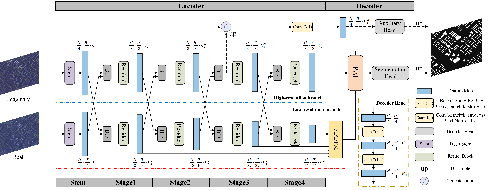

# PFFN: Progressive Feature Fusion Network for Building Footprint Extraction Using Complex-Valued PolSAR Images
This repo contains the codes for the paper: Progressive Feature Fusion Network for Building Footprint Extraction Using Complex-Valued PolSAR Images. 

## Folder Structure

## Data Preprocessing

## Install

## Usage

